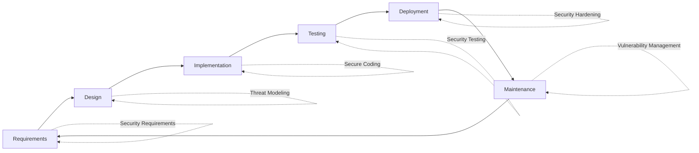

# Application Security

Welcome to the Application Security domain. This section covers secure coding practices, web and mobile security, API protection, and application security tools.

## Overview

Application security (AppSec) focuses on building secure software and identifying vulnerabilities in applications throughout the software development lifecycle. As an AppSec professional, you'll work with developers to create secure code and protect applications from attacks.

!!! quote "Shift Left Security"
    The best time to fix a security vulnerability is before it's written. The second-best time is during development. The worst time is in production.

## What You'll Learn

This domain covers six major categories:

### :material-code-tags: Secure Coding

Learn to write secure code from the ground up.

**Topics Covered:**
- Secure Software Development Lifecycle (SDLC)
- Input validation and sanitization
- Authentication and session management
- Authorization and access control
- Cryptography best practices
- Secure error handling

[Start Learning →](secure-coding/index.md){ .md-button }

### :material-web: Web Security

Master web application security testing and protection.

**Topics Covered:**
- OWASP Top 10 vulnerabilities
- SQL Injection attacks and prevention
- Cross-Site Scripting (XSS)
- Cross-Site Request Forgery (CSRF)
- Server-Side Request Forgery (SSRF)
- XML External Entity (XXE) attacks
- File upload vulnerabilities
- Authentication and authorization flaws

[Start Learning →](web-security/index.md){ .md-button }

### :material-cellphone-lock: Mobile Security

Secure mobile applications on Android and iOS platforms.

**Topics Covered:**
- Android application security
- iOS application security
- Mobile OWASP Top 10
- Mobile app reverse engineering
- Secure mobile development practices

[Start Learning →](mobile-security/index.md){ .md-button }

### :material-api: API Security

Protect REST and GraphQL APIs from attacks.

**Topics Covered:**
- REST API security best practices
- GraphQL security considerations
- API authentication mechanisms (OAuth, JWT)
- Rate limiting and throttling
- API security testing

[Start Learning →](api-security/index.md){ .md-button }

### :material-file-search: Code Review

Learn manual and automated code review techniques.

**Topics Covered:**
- Manual secure code review methodology
- Static Application Security Testing (SAST)
- Dynamic Application Security Testing (DAST)
- Software Composition Analysis (SCA)
- Secure coding patterns

[Start Learning →](code-review/index.md){ .md-button }

### :material-application-cog: AppSec Tools

Master professional application security tools.

**Topics Covered:**
- Burp Suite Professional
- OWASP ZAP
- Semgrep for code analysis
- SonarQube for code quality and security

[Start Learning →](appsec-tools/index.md){ .md-button }

## Secure SDLC Integration

## Core Competencies

To excel in application security, develop these competencies:

### Technical Skills

- **Programming**: Proficiency in multiple languages (Java, Python, JavaScript, C#, etc.)
- **Web Technologies**: Deep understanding of HTTP, HTML, JavaScript, cookies, sessions
- **Databases**: SQL and NoSQL security considerations
- **Frameworks**: Spring, Django, Express.js, .NET, etc.
- **APIs**: REST, GraphQL, SOAP architectures
- **Mobile Platforms**: Android and iOS development basics

### Security Knowledge

- **OWASP Top 10**: Web and mobile vulnerability categories
- **CWE**: Common Weakness Enumeration
- **SANS Top 25**: Most dangerous software errors
- **Threat Modeling**: STRIDE, PASTA, attack trees
- **Secure Design Patterns**: Security-focused architecture

### Soft Skills

- **Developer Collaboration**: Work effectively with development teams
- **Communication**: Explain vulnerabilities clearly to developers
- **Prioritization**: Assess risk and prioritize fixes
- **Training**: Educate developers on secure coding
- **Diplomacy**: Balance security with business needs

## Career Paths

Application security skills lead to various career opportunities:

- **Application Security Engineer**: Assess and secure applications
- **Security Code Reviewer**: Review code for security issues
- **Penetration Tester (Web/Mobile)**: Specialized application testing
- **Security Architect**: Design secure application architectures
- **DevSecOps Engineer**: Integrate security into CI/CD pipelines
- **Bug Bounty Hunter**: Find vulnerabilities in bug bounty programs
- **AppSec Consultant**: Provide security advisory services

## Recommended Learning Path

If you're new to application security, follow this suggested sequence:

1. **Start with Secure Coding Fundamentals**
   - Learn secure SDLC principles
   - Understand common vulnerability classes
   - Practice secure input validation

2. **Master Web Security**
   - Study OWASP Top 10
   - Practice on intentionally vulnerable apps (DVWA, WebGoat)
   - Learn Burp Suite and ZAP

3. **Explore Mobile Security**
   - Learn Android and iOS security models
   - Practice mobile app reverse engineering
   - Study Mobile OWASP Top 10

4. **Dive into API Security**
   - Understand API authentication/authorization
   - Learn API testing techniques
   - Practice GraphQL security

5. **Advance to Code Review**
   - Learn SAST tool usage
   - Practice manual code review
   - Develop secure coding patterns

## Certifications

Application security certifications to consider:

- **OSWE** (Offensive Security Web Expert): Advanced web security
- **GWAPT** (GIAC Web Application Penetration Tester): Web app testing
- **GWEB** (GIAC Web Application Defender): Secure web development
- **CSSLP** (Certified Secure Software Lifecycle Professional): Secure SDLC
- **CEH** (Certified Ethical Hacker): Includes web app security
- **CompTIA Security+**: Includes application security basics
- **Certified Secure Software Lifecycle Professional**: SDL focus

See our [Certifications Guide](../resources/certifications.md) for detailed mapping.

## Practice Platforms

Build your AppSec skills on these platforms:

**Web Security:**
- PortSwigger Web Security Academy
- OWASP WebGoat
- Damn Vulnerable Web Application (DVWA)
- HackTheBox (web challenges)
- TryHackMe (OWASP path)

**Mobile Security:**
- OWASP MSTG (Mobile Security Testing Guide)
- AndroGoat
- DIVA Android
- Damn Vulnerable iOS App

**API Security:**
- crAPI (Completely Ridiculous API)
- OWASP Juice Shop (includes API challenges)
- VAmPI (Vulnerable API)

**Bug Bounty:**
- HackerOne
- Bugcrowd
- Intigriti
- YesWeHack

See [Labs & Practice](../resources/labs-practice.md) for more platforms.

## Tools You'll Learn

This domain covers these professional tools:

**Web Testing:**
- Burp Suite Professional
- OWASP ZAP
- Nikto
- SQLmap

**SAST (Static Analysis):**
- Semgrep
- SonarQube
- Checkmarx
- Veracode
- Fortify

**DAST (Dynamic Analysis):**
- Burp Suite Scanner
- OWASP ZAP (active scan)
- Acunetix
- AppScan

**SCA (Composition Analysis):**
- Snyk
- WhiteSource
- Black Duck
- Dependabot

**Mobile Testing:**
- MobSF (Mobile Security Framework)
- Frida
- objection
- Drozer (Android)
- Hopper/Ghidra (reverse engineering)

**API Testing:**
- Postman
- SoapUI
- Insomnia
- GraphQL Playground

## Security Principles

As an application security professional, remember:

1. **Trust Nothing**: Validate all input, authenticate all requests
2. **Defense in Depth**: Multiple layers of security controls
3. **Least Privilege**: Grant minimum necessary permissions
4. **Fail Securely**: Ensure failures don't expose vulnerabilities
5. **Security by Design**: Build security in from the start
6. **Keep it Simple**: Complexity is the enemy of security
7. **Don't Reinvent the Wheel**: Use proven security libraries
8. **Stay Updated**: Patch dependencies and frameworks

## The AppSec Professional's Mindset

Develop these critical thinking patterns:

- **Think Like an Attacker**: How would you exploit this?
- **Understand the Business**: Balance security with functionality
- **Educate, Don't Blame**: Help developers improve
- **Automate Everything**: Make security seamless
- **Prioritize Risk**: Focus on what matters most
- **Continuous Learning**: Security evolves constantly

## OWASP Top 10 (2021)

The most critical web application security risks:

1. **A01: Broken Access Control**
2. **A02: Cryptographic Failures**
3. **A03: Injection**
4. **A04: Insecure Design**
5. **A05: Security Misconfiguration**
6. **A06: Vulnerable and Outdated Components**
7. **A07: Identification and Authentication Failures**
8. **A08: Software and Data Integrity Failures**
9. **A09: Security Logging and Monitoring Failures**
10. **A10: Server-Side Request Forgery (SSRF)**

Learn more in [OWASP Top 10](web-security/owasp-top-10.md).

## Community & Resources

Stay connected with the application security community:

- **OWASP**: Join local chapters and global projects
- **Twitter/X**: Follow AppSec researchers and tool developers
- **Bug Bounty Platforms**: Participate in responsible disclosure
- **Conferences**: OWASP AppSec, Black Hat, DEF CON
- **Blogs**: PortSwigger Research, Snyk Blog, HackerOne Hacktivity
- **Reddit**: r/netsec, r/websecurity, r/bugbounty

## Next Steps

Choose a category to begin your application security journey:

-   :material-code-tags: **Secure Coding**

    ---

    Learn to write secure code from the ground up

    [:octicons-arrow-right-24: Start](secure-coding/index.md)

-   :material-web: **Web Security**

    ---

    Master web application security and OWASP Top 10

    [:octicons-arrow-right-24: Start](web-security/index.md)

-   :material-cellphone-lock: **Mobile Security**

    ---

    Secure Android and iOS applications

    [:octicons-arrow-right-24: Start](mobile-security/index.md)

-   :material-api: **API Security**

    ---

    Protect REST and GraphQL APIs

    [:octicons-arrow-right-24: Start](api-security/index.md)

---

**Secure code is not just about preventing vulnerabilities - it's about building trust.**
