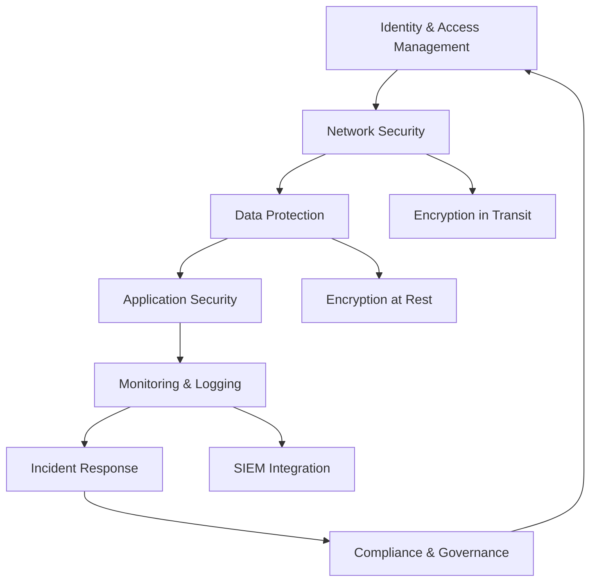

# Cloud & Infrastructure Security

Welcome to the Cloud & Infrastructure Security domain. This section covers cloud platform security, container security, Kubernetes security, and infrastructure hardening.

## Overview

Cloud and infrastructure security focuses on securing modern cloud environments, containerized applications, and the underlying infrastructure. As cloud adoption accelerates, mastering cloud security is essential for protecting organizations' most critical assets.

!!! info "Shared Responsibility Model"
    In cloud environments, security is a shared responsibility between the cloud provider and the customer. Understanding this division is fundamental to cloud security.

## What You'll Learn

This domain covers seven major categories:

### :material-aws: AWS Security

Master security in Amazon Web Services, the world's leading cloud platform.

**Topics Covered:**
- IAM best practices and policies
- VPC security and network isolation
- S3 bucket security and encryption
- EC2 instance hardening
- Lambda and serverless security
- CloudTrail monitoring and logging
- AWS Security Hub and GuardDuty

[Start Learning →](aws-security/index.md){ .md-button }

### :material-microsoft-azure: Azure Security

Secure Microsoft Azure cloud environments effectively.

**Topics Covered:**
- Azure Active Directory (Azure AD)
- Network security and segmentation
- Storage account security
- Virtual machine hardening
- Microsoft Defender for Cloud
- Azure Sentinel (SIEM)

[Start Learning →](azure-security/index.md){ .md-button }

### :material-google-cloud: GCP Security

Protect Google Cloud Platform resources and workloads.

**Topics Covered:**
- IAM and service accounts
- VPC configuration and security
- Cloud Storage security
- Compute Engine hardening
- Security Command Center

[Start Learning →](gcp-security/index.md){ .md-button }

### :material-docker: Container Security

Secure containerized applications and Docker environments.

**Topics Covered:**
- Docker security best practices
- Container image scanning and CVE detection
- Runtime security monitoring
- Container registry security
- Secure container deployment

[Start Learning →](container-security/index.md){ .md-button }

### :material-kubernetes: Kubernetes Security

Harden Kubernetes clusters and secure cloud-native deployments.

**Topics Covered:**
- Kubernetes cluster hardening (CIS Benchmarks)
- RBAC policies and least privilege
- Network policies and segmentation
- Pod security standards
- Secrets management
- Admission controllers and policy enforcement

[Start Learning →](kubernetes-security/index.md){ .md-button }

### :material-server-security: Infrastructure Hardening

Harden operating systems and infrastructure components.

**Topics Covered:**
- Linux server hardening (CIS, STIGs)
- Windows server hardening
- Network segmentation strategies
- Zero Trust Architecture
- Compliance frameworks (PCI-DSS, HIPAA, SOC 2)

[Start Learning →](infrastructure-hardening/index.md){ .md-button }

### :material-cloud-cog: Cloud Tools

Master Infrastructure as Code (IaC) security and cloud security tools.

**Topics Covered:**
- Terraform security scanning
- Ansible security automation
- Cloud Security Posture Management (CSPM)
- Infrastructure as Code (IaC) scanning

[Start Learning →](cloud-tools/index.md){ .md-button }

## Cloud Security Architecture

## Core Competencies

To excel in cloud and infrastructure security, develop these competencies:

### Technical Skills

- **Cloud Platforms**: Deep knowledge of AWS, Azure, and/or GCP
- **Networking**: VPCs, subnets, security groups, network ACLs
- **IAM**: Identity and access management, roles, policies
- **Containerization**: Docker, container orchestration
- **Kubernetes**: K8s architecture, components, and security
- **Infrastructure as Code**: Terraform, CloudFormation, ARM templates
- **Scripting**: Python, Bash, PowerShell for automation
- **Linux/Windows**: OS-level security and hardening

### Cloud Security Frameworks

- **CIS Benchmarks**: Configuration hardening standards
- **CSA Security Guidance**: Cloud Security Alliance recommendations
- **NIST SP 800-53**: Security controls for cloud
- **AWS Well-Architected Framework**: Security pillar
- **Azure Security Benchmark**: Azure security baseline
- **GCP Security Best Practices**: Google's security guidance

### Compliance Standards

- **SOC 2**: Service Organization Control
- **PCI-DSS**: Payment Card Industry Data Security Standard
- **HIPAA**: Health Insurance Portability and Accountability Act
- **GDPR**: General Data Protection Regulation
- **FedRAMP**: Federal Risk and Authorization Management Program

## Career Paths

Cloud and infrastructure security skills lead to various opportunities:

- **Cloud Security Engineer**: Secure cloud infrastructure and services
- **Cloud Security Architect**: Design secure cloud architectures
- **DevSecOps Engineer**: Integrate security into cloud CI/CD
- **Kubernetes Security Specialist**: Secure container orchestration
- **Cloud Compliance Manager**: Ensure cloud compliance
- **Site Reliability Engineer (SRE)**: Balance security and reliability
- **Infrastructure Security Engineer**: Harden servers and networks

## Recommended Learning Path

If you're new to cloud security, follow this suggested sequence:

1. **Start with a Major Cloud Platform**
   - Choose AWS, Azure, or GCP
   - Learn the fundamentals of the platform
   - Understand the shared responsibility model
   - Master IAM and networking basics

2. **Learn Infrastructure Security Basics**
   - Study Linux and Windows hardening
   - Understand network segmentation
   - Learn encryption fundamentals

3. **Master Container Security**
   - Learn Docker security best practices
   - Practice container image scanning
   - Understand runtime security

4. **Advance to Kubernetes Security**
   - Learn K8s architecture
   - Study RBAC and network policies
   - Practice cluster hardening

5. **Explore Infrastructure as Code**
   - Learn Terraform or CloudFormation
   - Practice IaC security scanning
   - Automate security controls

6. **Specialize in Multi-Cloud or Compliance**
   - Expand to additional cloud platforms
   - Study compliance frameworks
   - Learn CSPM tools

## Certifications

Cloud and infrastructure security certifications to consider:

**AWS:**
- **AWS Certified Security - Specialty**: Advanced AWS security
- **AWS Certified Solutions Architect**: Includes security design

**Azure:**
- **Microsoft Certified: Azure Security Engineer Associate (AZ-500)**: Azure security
- **Microsoft Certified: Security Operations Analyst Associate (SC-200)**: Sentinel and security ops

**GCP:**
- **Google Cloud Professional Cloud Security Engineer**: GCP security expertise

**Kubernetes:**
- **Certified Kubernetes Security Specialist (CKS)**: K8s security
- **Certified Kubernetes Administrator (CKA)**: K8s administration

**Multi-Cloud & Vendor-Neutral:**
- **CCSP** (Certified Cloud Security Professional): ISC² cloud security
- **CompTIA Cloud+**: Cloud fundamentals with security

**Container Security:**
- **Docker Certified Associate**: Container fundamentals

See our [Certifications Guide](../resources/certifications.md) for detailed mapping.

## Practice Platforms

Build your cloud security skills on these platforms:

**Cloud Ranges:**
- AWS CloudQuest (Security role)
- Azure Sandbox
- Google Cloud Skills Boost
- A Cloud Guru / Pluralsight
- TryHackMe (Cloud Security path)

**Intentionally Vulnerable:**
- CloudGoat (AWS)
- AWSGoat (AWS)
- AzureGoat (Azure)
- GCPGoat (GCP)
- Damn Vulnerable Cloud Application

**Kubernetes:**
- KubeCon workshops
- Kubernetes The Hard Way
- Katacoda (Kubernetes scenarios)

See [Labs & Practice](../resources/labs-practice.md) for more platforms.

## Tools You'll Learn

This domain covers these professional tools:

**Cloud Security:**
- AWS Security Hub, GuardDuty, Macie
- Azure Defender for Cloud, Sentinel
- GCP Security Command Center
- Prisma Cloud (multi-cloud)
- Orca Security (multi-cloud)

**Container Security:**
- Trivy (image scanning)
- Snyk Container
- Aqua Security
- Sysdig Secure
- Falco (runtime security)

**Kubernetes Security:**
- kube-bench (CIS benchmarks)
- kube-hunter (pentesting)
- Falco (runtime detection)
- Open Policy Agent (OPA)
- Gatekeeper

**Infrastructure as Code:**
- Terraform
- AWS CloudFormation
- Azure Resource Manager
- tfsec (Terraform scanning)
- Checkov (IaC scanning)
- Terrascan

**CSPM (Cloud Security Posture Management):**
- Prowler (AWS)
- ScoutSuite (multi-cloud)
- CloudSploit

**Configuration Management:**
- Ansible
- Chef
- Puppet

## Cloud Security Principles

As a cloud security professional, remember:

1. **Shared Responsibility**: Understand what you secure vs. what the provider secures
2. **Least Privilege**: Grant minimal necessary permissions
3. **Defense in Depth**: Layer security controls
4. **Encrypt Everything**: Data at rest and in transit
5. **Monitor Continuously**: Enable comprehensive logging
6. **Automate Security**: Use IaC and policy-as-code
7. **Assume Breach**: Design for compromise scenarios
8. **Patch Regularly**: Keep systems and dependencies updated

## The 5 Pillars of Cloud Security

1. **Identity and Access Management**
   - Strong authentication (MFA)
   - Least privilege access
   - Regular access reviews

2. **Network Security**
   - Segmentation and isolation
   - Security groups and firewalls
   - Private networking (VPCs)

3. **Data Protection**
   - Encryption at rest
   - Encryption in transit
   - Key management (KMS)

4. **Monitoring and Logging**
   - Centralized logging (CloudTrail, etc.)
   - Real-time alerting
   - SIEM integration

5. **Compliance and Governance**
   - Policy enforcement
   - Configuration management
   - Audit and compliance reporting

## Container Security Best Practices

1. Use minimal base images
2. Scan images for vulnerabilities
3. Sign and verify images
4. Run containers as non-root
5. Implement resource limits
6. Use read-only file systems
7. Monitor runtime behavior
8. Regularly update images

## Kubernetes Security Best Practices

1. Enable RBAC and use least privilege
2. Implement network policies
3. Use Pod Security Standards
4. Scan container images
5. Enable audit logging
6. Secure etcd
7. Use secrets management solutions
8. Regularly update Kubernetes

## Community & Resources

Stay connected with the cloud security community:

- **AWS re:Inforce**: AWS security conference
- **Azure Security Center Community**: Microsoft security resources
- **Google Cloud Next**: GCP conference
- **KubeCon + CloudNativeCon**: Kubernetes and CNCF conference
- **Cloud Security Alliance**: Industry organization
- **Reddit**: r/aws, r/azure, r/kubernetes
- **Twitter/X**: Follow cloud security researchers

## Next Steps

Choose a category to begin your cloud and infrastructure security journey:

-   :material-aws: **AWS Security**

    ---

    Master security in Amazon Web Services

    [:octicons-arrow-right-24: Start](aws-security/index.md)

-   :material-microsoft-azure: **Azure Security**

    ---

    Secure Microsoft Azure environments

    [:octicons-arrow-right-24: Start](azure-security/index.md)

-   :material-docker: **Container Security**

    ---

    Secure Docker and containerized applications

    [:octicons-arrow-right-24: Start](container-security/index.md)

-   :material-kubernetes: **Kubernetes Security**

    ---

    Harden K8s clusters and deployments

    [:octicons-arrow-right-24: Start](kubernetes-security/index.md)

---

**The cloud is powerful, but power requires responsibility. Secure it well.**
