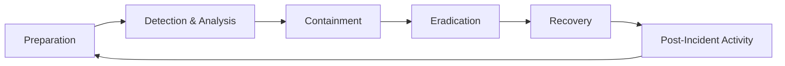

# Defensive Security

Welcome to the Defensive Security domain. This section covers threat detection, incident response, security operations, and proactive defense strategies.

## Overview

Defensive security focuses on protecting systems, detecting threats, responding to incidents, and continuously improving security posture. As a defensive security professional, you'll build robust defenses and hunt for threats before they cause damage.

!!! tip "Defense in Depth"
    Effective defensive security relies on multiple layers of protection. No single control is perfect - combining detection, prevention, and response creates resilient security.

## What You'll Learn

This domain covers six major categories:

### :material-radar: Threat Detection

Build capabilities to identify malicious activity across your environment.

**Topics Covered:**
- Network traffic monitoring and analysis
- Endpoint detection and response (EDR)
- Behavioral analysis and anomaly detection
- Threat intelligence integration
- Detection rule development

[Start Learning →](threat-detection/index.md){ .md-button }

### :material-ambulance: Incident Response

Master the art of responding to and recovering from security incidents.

**Topics Covered:**
- Incident response frameworks (NIST, SANS)
- Preparation and planning
- Incident identification and triage
- Containment strategies
- Eradication and recovery
- Lessons learned processes
- Digital forensics fundamentals

[Start Learning →](incident-response/index.md){ .md-button }

### :material-database-search: SIEM & Log Management

Learn to collect, correlate, and analyze security logs at scale.

**Topics Covered:**
- SIEM architecture and design
- Splunk, ELK Stack, Microsoft Sentinel
- Log correlation and analysis
- Use case development
- Alert tuning and optimization

[Start Learning →](siem-and-log-management/index.md){ .md-button }

### :material-security: SOC Operations

Build and operate effective Security Operations Centers.

**Topics Covered:**
- SOC structure and roles
- Alert triage and investigation
- Playbook development
- Metrics and KPI reporting
- Automation and orchestration (SOAR)

[Start Learning →](soc-operations/index.md){ .md-button }

### :material-magnify: Threat Hunting

Proactively search for threats that evade traditional defenses.

**Topics Covered:**
- Hypothesis-driven hunting methodology
- Threat modeling and adversary profiling
- Hunting techniques and tools
- MITRE ATT&CK framework
- Hunt report documentation

[Start Learning →](threat-hunting/index.md){ .md-button }

### :material-shield-check: Blue Team Tools

Master the defensive security toolkit.

**Topics Covered:**
- Intrusion Detection/Prevention Systems (IDS/IPS)
- Endpoint Detection and Response (EDR)
- Network security monitoring tools
- Security orchestration platforms (SOAR)

[Start Learning →](blue-team-tools/index.md){ .md-button }

## Incident Response Lifecycle

## Core Competencies

To excel in defensive security, develop these competencies:

### Technical Skills

- **Log Analysis**: Parse and analyze diverse log formats
- **Network Analysis**: Understand traffic patterns and protocols
- **Malware Analysis**: Basic static and dynamic malware analysis
- **Scripting**: Python, PowerShell for automation
- **Forensics**: Evidence collection and preservation
- **Threat Intelligence**: Consume and operationalize threat feeds

### Frameworks & Standards

- **NIST Cybersecurity Framework**: Comprehensive security framework
- **MITRE ATT&CK**: Adversary tactics and techniques
- **Cyber Kill Chain**: Attack lifecycle model
- **SANS Incident Response**: Six-phase IR process
- **ISO 27001/27002**: Information security standards

### Soft Skills

- **Critical Thinking**: Analyze complex security events
- **Communication**: Escalate and report incidents effectively
- **Stress Management**: Handle high-pressure incident situations
- **Collaboration**: Work with cross-functional teams
- **Continuous Learning**: Stay updated on evolving threats

## Career Paths

Defensive security skills lead to various career opportunities:

- **Security Analyst (SOC Analyst)**: Monitor and respond to security alerts
- **Incident Responder**: Lead incident investigation and remediation
- **Threat Hunter**: Proactively search for threats
- **SIEM Engineer**: Design and maintain SIEM infrastructure
- **Security Operations Manager**: Lead SOC teams
- **Forensics Analyst**: Conduct detailed security investigations
- **Threat Intelligence Analyst**: Analyze and disseminate threat intelligence

## Recommended Learning Path

If you're new to defensive security, follow this suggested sequence:

1. **Start with Threat Detection Fundamentals**
   - Learn network and endpoint monitoring
   - Understand common attack patterns
   - Practice log analysis

2. **Master SIEM & Log Management**
   - Learn Splunk or ELK Stack
   - Develop correlation rules
   - Build detection use cases

3. **Learn Incident Response**
   - Study IR frameworks
   - Practice incident triage
   - Conduct tabletop exercises

4. **Build SOC Operations Skills**
   - Understand SOC workflows
   - Develop playbooks
   - Learn automation tools

5. **Advance to Threat Hunting**
   - Study MITRE ATT&CK
   - Develop hunting hypotheses
   - Practice proactive threat detection

## Certifications

Defensive security certifications to consider:

- **GCIH** (GIAC Certified Incident Handler): Incident response and detection
- **GCIA** (GIAC Certified Intrusion Analyst): Network traffic analysis
- **GCFA** (GIAC Certified Forensic Analyst): Digital forensics
- **GMON** (GIAC Continuous Monitoring Certification): Security monitoring
- **Blue Team Level 1 (BTL1)**: Entry-level defensive security
- **Blue Team Level 2 (BTL2)**: Advanced defensive operations
- **Splunk Certified**: Various Splunk specializations
- **Microsoft Security Operations Analyst (SC-200)**: Azure Sentinel and Microsoft security

See our [Certifications Guide](../resources/certifications.md) for detailed mapping.

## Practice Platforms

Build your defensive skills on these platforms:

**General Blue Team:**
- CyberDefenders
- Blue Team Labs Online
- LetsDefend
- Boss of the SOC (BOTS) - Splunk

**Threat Hunting:**
- TryHackMe (Cyber Defense path)
- Immersive Labs
- RangeForce

**SIEM Practice:**
- Splunk Boss of the SOC datasets
- Security Onion
- Microsoft Sentinel (free tier)

See [Labs & Practice](../resources/labs-practice.md) for more platforms.

## Tools You'll Learn

This domain covers these professional tools:

**SIEM Platforms:**
- Splunk Enterprise Security
- Elastic (ELK) Stack
- Microsoft Sentinel
- IBM QRadar

**Network Monitoring:**
- Zeek (formerly Bro)
- Suricata
- Wireshark
- NetworkMiner

**Endpoint Detection:**
- Microsoft Defender for Endpoint
- CrowdStrike Falcon
- Carbon Black
- SentinelOne

**Threat Intelligence:**
- MISP
- OpenCTI
- ThreatConnect
- Anomali

**Incident Response:**
- TheHive
- KAPE
- Velociraptor
- GRR (Google Rapid Response)

**SOAR Platforms:**
- Splunk SOAR (Phantom)
- Palo Alto Cortex XSOAR
- IBM Resilient

## Defensive Principles

As a defensive security professional, remember:

1. **Assume Breach**: Design defenses assuming attackers will get in
2. **Defense in Depth**: Layer multiple security controls
3. **Least Privilege**: Grant minimum necessary access
4. **Monitor Everything**: Comprehensive visibility is critical
5. **Automate Responses**: Speed matters in incident response
6. **Continuous Improvement**: Learn from every incident
7. **Threat-Informed Defense**: Use threat intelligence to prioritize defenses

## The SOC Analyst's Mindset

Develop these critical thinking patterns:

- **Question Everything**: Don't accept alerts at face value
- **Context is King**: Understand normal before identifying abnormal
- **Think Like an Attacker**: Understand offensive techniques
- **Follow the Data**: Let evidence guide investigation
- **Document Thoroughly**: Every action, every finding
- **Escalate Appropriately**: Know when to involve senior analysts

## Community & Resources

Stay connected with the defensive security community:

- **Twitter/X**: Follow SOC analysts and IR professionals
- **Reddit**: r/blueteamsec, r/netsec
- **Conferences**: SANS Summit, Splunk .conf, RSA Conference
- **Blogs**: Read from CrowdStrike, Microsoft Threat Intelligence, Mandiant
- **Podcasts**: Defensive Security Podcast, Purple Squad Security

## Next Steps

Choose a category to begin your defensive security journey:

-   :material-radar: **Threat Detection**

    ---

    Build capabilities to identify malicious activity

    [:octicons-arrow-right-24: Start](threat-detection/index.md)

-   :material-ambulance: **Incident Response**

    ---

    Master incident investigation and remediation

    [:octicons-arrow-right-24: Start](incident-response/index.md)

-   :material-database-search: **SIEM & Log Management**

    ---

    Collect, correlate, and analyze security logs

    [:octicons-arrow-right-24: Start](siem-and-log-management/index.md)

-   :material-security: **SOC Operations**

    ---

    Build and operate effective Security Operations Centers

    [:octicons-arrow-right-24: Start](soc-operations/index.md)

---

**The best offense is a great defense. Stay vigilant, stay curious, and keep hunting!**
