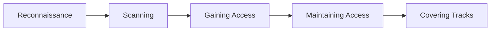

# Getting Started

Welcome to the Advanced Cybersecurity Course! This guide will help you navigate the course effectively and get the most out of your learning experience.

## Course Structure

The course is organized into four major domains, accessible via the top navigation tabs:

### :material-sword-cross: Offensive Security
Learn ethical hacking, penetration testing, exploit development, red teaming, and vulnerability research.

**Categories:**
- Penetration Testing
- Exploit Development
- Red Teaming
- Vulnerability Research
- Tools & Frameworks

### :material-shield-check: Defensive Security
Build defensive capabilities including threat detection, incident response, and security operations.

**Categories:**
- Threat Detection
- Incident Response
- SIEM & Log Management
- SOC Operations
- Threat Hunting
- Blue Team Tools

### :material-application-braces: Application Security
Master secure coding, web/mobile/API security, and application security tools and methodologies.

**Categories:**
- Secure Coding
- Web Security
- Mobile Security
- API Security
- Code Review
- AppSec Tools

### :material-cloud-lock: Cloud & Infrastructure Security
Secure cloud environments and infrastructure across AWS, Azure, GCP, containers, and Kubernetes.

**Categories:**
- AWS Security
- Azure Security
- GCP Security
- Container Security
- Kubernetes Security
- Infrastructure Hardening
- Cloud Tools

## Navigation Guide

### Top Navigation Tabs
Click the tabs at the top of the page to switch between the four major domains. The active tab is highlighted.

### Sidebar Navigation
The left sidebar shows all sections and pages within the current domain. Click to navigate to specific topics.

### Search
Use the search bar (top right, or press ++f++ or ++s++) to quickly find content:

- Search for specific topics (e.g., "SQL injection")
- Search for tools (e.g., "Burp Suite")
- Search for techniques (e.g., "lateral movement")
- Search for concepts (e.g., "zero trust")

### Table of Contents
The right sidebar shows the table of contents for the current page, making it easy to jump to specific sections.

### Breadcrumbs
At the top of each page, breadcrumb navigation shows your current location in the course hierarchy.

## Learning Strategies

### 1. Follow a Learning Path

If you're new to a domain or preparing for a certification, use our curated [Learning Paths](resources/learning-paths.md) which provide structured study sequences.

**Example Learning Paths:**
- Offensive Security: Pentester Track
- Defensive Security: SOC Analyst Track
- Application Security: Secure Developer Track
- Cloud Security: AWS Security Specialist Track

### 2. Topic-Based Learning

Already know what you want to learn? Navigate directly to specific topics using the domain tabs and sidebar navigation.

### 3. Certification Preparation

Preparing for a certification? See our [Certifications](resources/certifications.md) guide which maps course content to certification objectives for:

- OSCP, OSWE, OSCE
- GIAC certifications (GPEN, GWAPT, GCIH, GCIA, etc.)
- Cloud certifications (AWS Security Specialty, Azure Security Engineer, etc.)
- CISSP domains

### 4. Hands-On Practice

Combine course content with hands-on practice using platforms listed in [Labs & Practice](resources/labs-practice.md):

- **Capture The Flag (CTF)**: HackTheBox, TryHackMe
- **Web Security**: PortSwigger Web Security Academy, DVWA
- **Cloud Labs**: AWS CloudQuest, Azure Sandbox
- **Mobile Security**: OWASP Mobile Security Testing Guide

## Page Structure

Each topic page follows a consistent structure for easy learning:

1. **Overview** - What you'll learn on this page
2. **Key Concepts** - Fundamental theory and principles
3. **Technical Details** - In-depth technical information
4. **Practical Examples** - Real-world scenarios with code
5. **Diagrams & Visualizations** - Visual representations
6. **Best Practices** - Industry standards and recommendations
7. **Common Pitfalls** - Mistakes to avoid
8. **Tools & Resources** - Related tools and further reading
9. **Hands-On Labs** - Practical exercises (where applicable)
10. **References** - Links to authoritative sources

## Using Code Examples

### Syntax Highlighting
All code examples include syntax highlighting for readability:

```python
# Example: Simple port scanner
import socket

def scan_port(host, port):
    sock = socket.socket(socket.AF_INET, socket.SOCK_STREAM)
    sock.settimeout(1)
    result = sock.connect_ex((host, port))
    sock.close()
    return result == 0
```

### Copy Button
Hover over any code block to reveal a copy button in the top-right corner. Click to copy the code to your clipboard.

### Code Annotations
Some examples include annotations explaining key parts:

```python
import requests

response = requests.get('https://api.example.com/data')  # (1)!
data = response.json()  # (2)!
```

1. Send HTTP GET request to API endpoint
2. Parse JSON response

## Visual Elements

### Admonitions

Important information is highlighted using admonitions:

!!! note
    Notes provide additional context and helpful information.

!!! tip
    Tips offer pro advice and best practices.

!!! warning
    Warnings highlight potential issues or common mistakes.

!!! danger
    Dangers indicate critical security concerns or risks.

!!! example
    Examples show practical use cases.

### Diagrams

Complex concepts include Mermaid diagrams:



### Keyboard Keys

Keyboard shortcuts and commands are styled: ++ctrl+c++, ++alt+tab++, ++enter++

### Tabs

Alternative approaches or platform-specific instructions use tabs:

=== "Linux"
    ```bash
    sudo apt-get update
    ```

=== "macOS"
    ```bash
    brew update
    ```

=== "Windows"
    ```powershell
    choco upgrade all
    ```

## Dark Mode

Toggle between light and dark themes using the icon in the top navigation. Your preference is saved automatically.

## Mobile Experience

The course is fully responsive and optimized for mobile devices:

- Tap the menu icon (☰) to access navigation
- Swipe to navigate between pages
- Search functionality works on mobile
- Code examples are scrollable on small screens

## Offline Access

To use the course offline:

1. Clone the repository: `git clone https://github.com/yourusername/cybersec.git`
2. Install dependencies: `pip install -r requirements.txt`
3. Serve locally: `mkdocs serve`
4. Access at http://127.0.0.1:8000

Alternatively, download the built site from the GitHub releases.

## Staying Current

Cybersecurity evolves rapidly. Here's how we keep content current:

- **Last Updated Timestamps**: Each page shows when it was last modified
- **Regular Updates**: Content is reviewed and updated quarterly
- **Version Control**: All changes are tracked in Git with clear commit messages
- **Community Contributions**: Users can suggest updates via GitHub

## Additional Resources

### Glossary
New to certain terms? Check the [Glossary](resources/glossary.md) for definitions of common cybersecurity terminology.

### Reference Materials
The [Reference Materials](resources/reference-materials.md) section includes:

- Security frameworks (NIST, CIS, OWASP)
- Compliance standards (PCI-DSS, HIPAA, GDPR)
- Tool documentation links
- Cheat sheets and quick references

### Community Resources
Join the cybersecurity community via [Community Resources](resources/community-resources.md):

- Discord servers
- Reddit communities
- Security forums
- Slack groups
- Twitter/X security communities

## Getting Help

### Search First
Most questions can be answered by searching the course content.

### Check the Glossary
Unfamiliar with a term? See the [Glossary](resources/glossary.md).

### GitHub Issues
Found an error or have a suggestion? [Open an issue](https://github.com/yourusername/cybersec/issues) on GitHub.

### Contribute
Want to improve the course? Contributions are welcome! See the README for contribution guidelines.

## Tips for Success

1. **Practice Regularly**: Cybersecurity is a hands-on field. Combine reading with practical labs.

2. **Build a Lab Environment**: Set up a home lab with VirtualBox, VMware, or cloud instances for practice.

3. **Take Notes**: Document your learning, especially commands, techniques, and tool usage.

4. **Join Communities**: Engage with other security professionals to share knowledge and stay motivated.

5. **Stay Curious**: Always ask "how does this work?" and "how could this be exploited or protected?"

6. **Follow the News**: Subscribe to security blogs, podcasts, and newsletters to stay current.

7. **Contribute Back**: As you learn, share your knowledge by writing blog posts, creating tools, or contributing to open source.

## Recommended Study Approach

### For Complete Beginners to a Domain

1. Read the domain index page (e.g., Offensive Security overview)
2. Follow the recommended learning path
3. Study topics sequentially within each category
4. Complete hands-on labs after each major topic
5. Review and practice regularly

### For Experienced Practitioners

1. Use search to find specific topics you want to deepen
2. Jump directly to relevant sections
3. Focus on advanced techniques and edge cases
4. Explore the "Tools & Frameworks" sections for new tools
5. Check "References" for deeper dives into specific topics

### For Certification Prep

1. Review the [Certifications](resources/certifications.md) mapping
2. Create a study plan covering all exam objectives
3. Read relevant course sections
4. Complete associated labs and exercises
5. Use additional practice exams and resources

## Next Steps

Ready to start learning? Choose your path:

- **[Offensive Security](offensive-security/index.md)** - Master ethical hacking and penetration testing
- **[Defensive Security](defensive-security/index.md)** - Build robust defensive capabilities
- **[Application Security](application-security/index.md)** - Secure your applications
- **[Cloud & Infrastructure](cloud-infrastructure/index.md)** - Protect cloud environments

Or explore:

- **[Learning Paths](resources/learning-paths.md)** - Structured study sequences
- **[Certifications](resources/certifications.md)** - Certification preparation guides
- **[Labs & Practice](resources/labs-practice.md)** - Hands-on practice platforms

---

**Happy learning! Remember: in cybersecurity, the learning never stops.**
